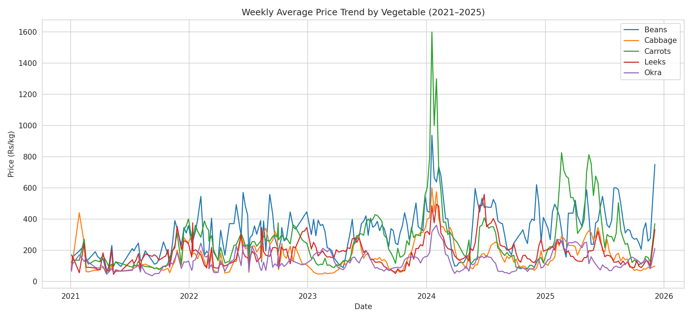
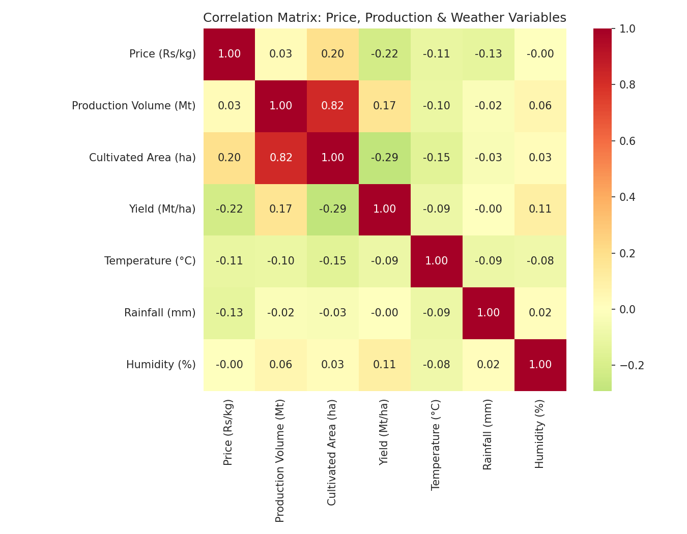
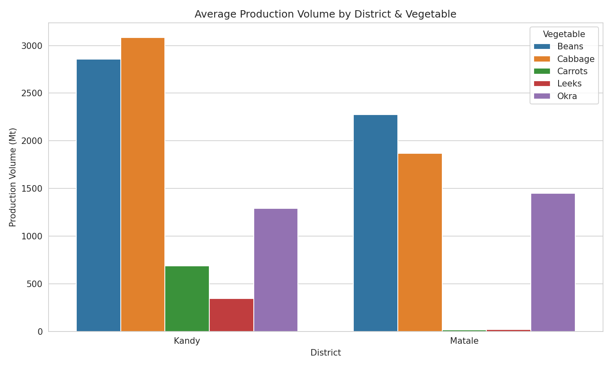
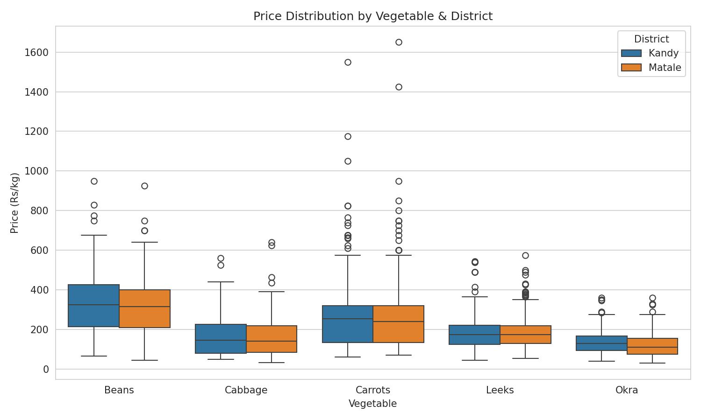
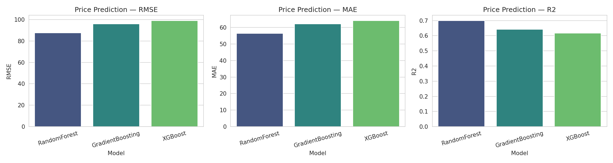
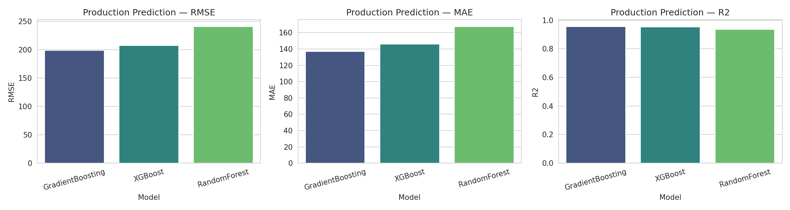
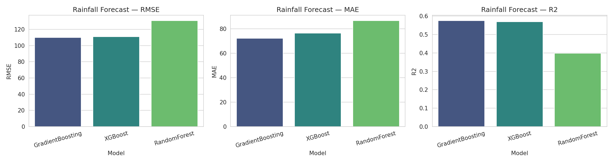
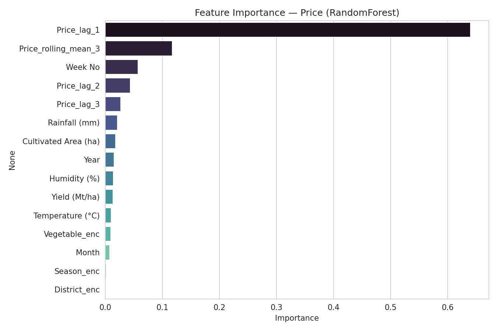
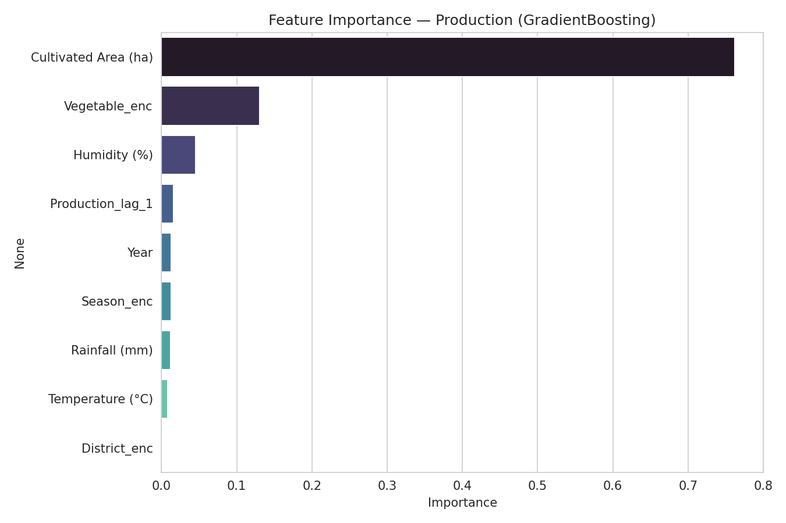
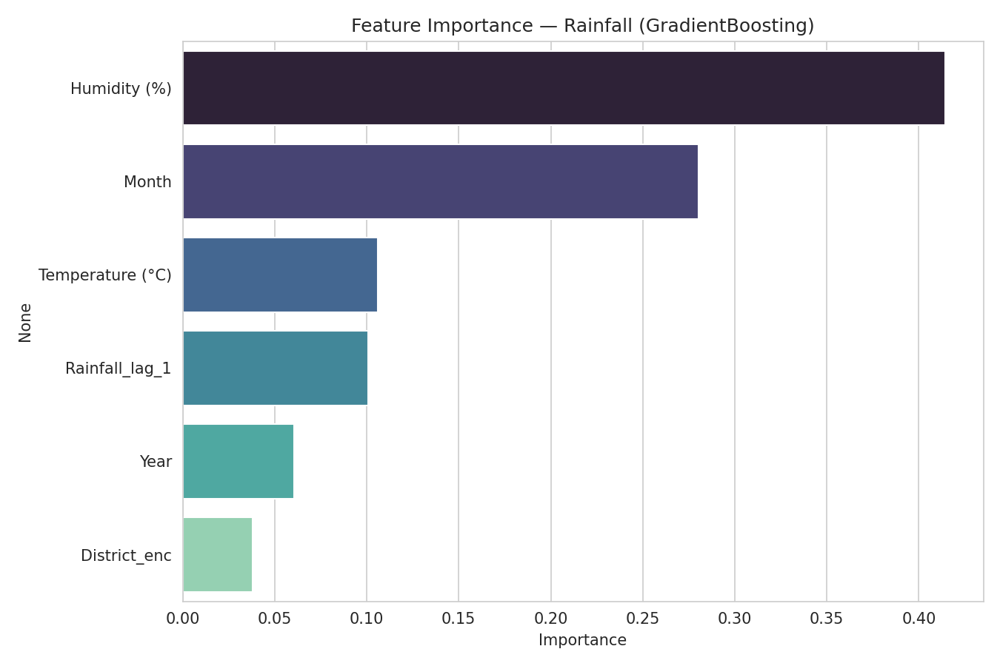

# AgriSense 2.1 — AI-Driven Vegetable Production & Price Optimization System

[](https://www.python.org/)
[](https://kivymd.readthedocs.io/)
[](https://www.mysql.com/)
[](https://scikit-learn.org/)
[](LICENSE)

**AgriSense 2.1** is an advanced, AI-driven mobile and desktop application tailored for Sri Lanka's agricultural ecosystem. The system leverages high-accuracy machine learning forecasting models (**Random Forest** for vegetable market prices, **Gradient Boosting** for seasonal production volumes, and **Gradient Boosting** for weather/rainfall forecasts), real-time climate monitoring, market analytics, and role-based insights to empower **Farmers**, **Traders**, **Policymakers**, and **System Administrators**.

> ### 🚀 Model Accuracy & Performance Upgrade
> In previous iterations, agricultural forecasting faced notable accuracy constraints, and the weather/rainfall forecasting model lacked predictive strength. To resolve these challenges and ensure production-grade reliability, the ML engine was comprehensively redesigned in [`AgriSense_ML_Pipeline.ipynb`](AgriSense_ML_Pipeline.ipynb). 
> 
> By benchmarking multiple modern ensemble architectures (**Random Forest**, **Gradient Boosting**, and **XGBoost**) alongside robust time-series lag feature engineering and rolling window statistics on held-out real-world test data (2021–2024 train split vs. 2025 unseen test split), AgriSense achieved substantial accuracy improvements across all three target domains.

---

## 📋 Table of Contents

- [Screenshots](#-screenshots)
- [Exploratory Data Analysis (EDA)](#-exploratory-data-analysis-eda--market-insights)
- [Machine Learning Architecture & Evaluation](#-machine-learning-architecture--model-evaluation)
- [Overview & Key Features](#-overview--key-features)
- [System Architecture](#-system-architecture)
- [Technology Stack](#-technology-stack)
- [Project Directory Structure](#-project-directory-structure)
- [Prerequisites](#-prerequisites)
- [Installation & Setup](#-installation--setup)
- [Database Setup & Seeding](#-database-setup--seeding)
- [Email Confirmation Endpoint](#-email-confirmation-endpoint)
- [Running the Application](#-running-the-application)
- [Demo User Credentials](#-demo-user-credentials)
- [Android APK Build Guide](#-android-apk-build-guide-buildozer)
- [Database Schema & Migrations](#-database-schema--migrations)
- [Author & License](#-author--license)

---

## 📸 Screenshots

### 🔐 Authentication & Onboarding

| Login Screen | Crop Selection |
|:---:|:---:|
|  |  |

### 📊 Role-Based Dashboards

| Admin Dashboard | Farmer Dashboard |
|:---:|:---:|
|  |  |

| Policymaker Dashboard | Trader Dashboard |
|:---:|:---:|
|  |  |

### 🔔 Insights & Alerts

| For You — Recommendations | Alerts |
|:---:|:---:|
|  |  |

### 📈 History & Analytics

| Beans — Price Trend (16 Weeks) | Beans — Production Volume (16 Weeks) |
|:---:|:---:|
|  |  |

### 👤 Profile & Settings

| Profile | Edit Profile | Feedback |
|:---:|:---:|:---:|
|  |  |  |

---

## 📈 Exploratory Data Analysis (EDA) & Market Insights

Exploratory Data Analysis was performed on historical Sri Lankan vegetable market price, production volume, and climate datasets spanning 2021–2025. Visualizations were generated directly through the ML pipeline:

### 1. 📉 Weekly Average Price Trend by Vegetable (2021–2025)

- **Description**: Displays multi-year historical wholesale price trajectories for key vegetable crops (*Beans, Cabbage, Carrots, Leeks, Okra*). It highlights baseline price inflation, sharp spike events, and long-term trend lines across agricultural seasons.

### 2. 🔗 Correlation Matrix: Price, Production & Weather Variables

- **Description**: Pearson correlation heatmap mapping interactions between wholesale vegetable prices, production volume, cultivated land area, crop yield (Mt/ha), temperature (°C), rainfall (mm), and humidity (%). It confirms strong correlations between climate inputs, cultivated area, and harvest volume.

### 3. 🗺️ Average Production Volume by District & Vegetable

- **Description**: Production volume breakdown across key agricultural producing districts in Sri Lanka (e.g., Nuwara Eliya, Matale, Kandy, Colombo). Illustrates crop specialization and volume concentration by region.

### 4. 📊 Wholesale Price Distribution by Vegetable & District

- **Description**: Boxplot distribution depicting wholesale price spreads (LKR/kg) across vegetables and districts, identifying price variances, seasonal outliers, and supply chain transport differentials.

---

## 🤖 Machine Learning Architecture & Model Evaluation

AgriSense uses a production-ready ML pipeline engineered to train, validate, and auto-select optimal models for three distinct forecasting targets: **Vegetable Wholesale Price**, **Crop Production Volume**, and **Rainfall / Weather Forecast**.

### ⚙️ Pipeline Overview & Methodology
1. **Data Integration**: Merges weekly prices, monthly weather records, and seasonal production figures into a unified dataset (`AgriSense_master_dataset.csv`).
2. **Feature Engineering**:
   - **Price Lags**: Lag 1, Lag 2, Lag 3, and 3-week rolling moving average of prices per crop-district group.
   - **Production Lags**: Previous season's production volume per crop-district group.
   - **Weather Lags**: Prior month's rainfall lag per district.
   - **Categorical Encoders**: Label encoding for `Season` (*Maha/Yala*), `Vegetable`, and `District` (exported to `encoders.json`).
3. **Train / Test Split Strategy**: Time-based realistic forecasting split:
   - **Training Set**: 2021 – 2024
   - **Held-Out Test Set**: 2025 (unseen evaluation)
4. **Candidate Regressors Tested**:
   - **Random Forest Regressor** (`n_estimators=300`)
   - **Gradient Boosting Regressor** (`n_estimators=300`, `learning_rate=0.05`, `max_depth=3`)
   - **XGBoost Regressor** (`n_estimators=400`, `learning_rate=0.05`, `max_depth=4`, `subsample=0.9`)

---

### 🏆 Model Performance & Selection Summary

The candidate models were evaluated on the held-out 2025 test dataset using **Root Mean Squared Error (RMSE)**, **Mean Absolute Error (MAE)**, and **Coefficient of Determination ($R^2$)**. The best-performing model with the lowest RMSE was automatically packaged:

| Target Domain | Candidate Models | Best Model Selected | Test RMSE | Test MAE | Test $R^2$ Score | Target Application in AgriSense |
| :--- | :--- | :---: | :---: | :---: | :---: | :--- |
| **Price (Rs/kg)** | Random Forest, Gradient Boosting, XGBoost | **RandomForest** | **87.63** | **56.39** | **0.7003** | Weekly vegetable market price forecast |
| **Production Volume (Mt)** | Gradient Boosting, XGBoost, Random Forest | **GradientBoosting** | **198.78** | **137.14** | **0.9563** | Seasonal crop yield & supply estimation |
| **Rainfall Forecast (mm)** | Gradient Boosting, XGBoost, Random Forest | **GradientBoosting** | **109.84** | **72.38** | **0.5755** | Regional precipitation & climate risk forecast |

---

### 📊 Model Performance Comparison Charts

| Price Model Comparison | Production Model Comparison | Weather (Rainfall) Model Comparison |
|:---:|:---:|:---:|
|  |  |  |

---

### 🔍 Feature Importance Analysis

| Price Model Feature Importance | Production Model Feature Importance | Weather Model Feature Importance |
|:---:|:---:|:---:|
|  |  |  |

- **Price Model**: Driven predominantly by recent historical price lags (`Price_lag_1`, `Price_rolling_mean_3`, `Price_lag_2`), followed by `Yield (Mt/ha)` and `Cultivated Area (ha)`.
- **Production Model**: Primarily influenced by `Cultivated Area (ha)` and previous seasonal production (`Production_lag_1`).
- **Weather Model**: Governed strongly by seasonal cycle (`Month`, `Year`) and antecedent rainfall (`Rainfall_lag_1`).

---

### 📦 Exported ML Assets (`AgriSense_outputs/`)

The pipeline packages all deployment assets directly into `AgriSense_outputs/`:
- `models/best_price_model.pkl` — Trained Random Forest price regressor
- `models/best_production_model.pkl` — Trained Gradient Boosting production regressor
- `models/best_weather_model.pkl` — Trained Gradient Boosting rainfall regressor
- `encoders.json` — Categorical label encoders for `Season`, `Vegetable`, and `District`
- `model_metadata.json` — Feature ordering, target names, and algorithm specifications
- `model_performance_summary.csv` — Full evaluation metrics for all 9 model iterations

#### Inference Code Example:
```python
import json
import joblib
import pandas as pd

# 1. Load trained model & label encoders
price_model = joblib.load("AgriSense_outputs/models/best_price_model.pkl")
with open("AgriSense_outputs/encoders.json") as f:
    encoders = json.load(f)

# 2. Build input dataframe with exact feature order
input_data = pd.DataFrame([{
    "Week No": 35,
    "Month": 9,
    "Year": 2026,
    "Season_enc": encoders["Season"]["Yala"],
    "Vegetable_enc": encoders["Vegetable"]["Carrots"],
    "District_enc": encoders["District"]["Kandy"],
    "Temperature (°C)": 24.5,
    "Rainfall (mm)": 115.0,
    "Humidity (%)": 78.0,
    "Cultivated Area (ha)": 140.0,
    "Yield (Mt/ha)": 18.2,
    "Price_lag_1": 250.0,
    "Price_lag_2": 242.0,
    "Price_lag_3": 238.0,
    "Price_rolling_mean_3": 243.33
}])

# 3. Generate real-time prediction
predicted_price = float(price_model.predict(input_data)[0])
print(f"Predicted Price: Rs. {predicted_price:.2f} / kg")
```

---

## ✨ Overview & Key Features

AgriSense addresses agricultural market volatility and crop overproduction/shortage issues through data intelligence.

### 🌟 Key Highlights

- **Role-Based Dashboards**: Customized interface tailored to user persona:
  - **Farmer**: Harvest planning, yield forecasts, market price trends, crop recommendations, and alert notifications.
  - **Trader**: Wholesale price projections, regional crop availability, price spike alerts, and market supply analytics.
  - **Policymaker**: National production trends, regional supply balance, climate impact monitoring, and policy recommendations.
  - **Admin**: User management, database seeding overview, system analytics, and user feedback monitoring with average rating metrics.
- **AI/ML Forecasting Engine**: Production-ready **Random Forest** and **Gradient Boosting** models predicting price, yield, and weather trends.
- **Interactive Visualizations**: Dynamic Matplotlib charts rendered seamlessly within KivyMD views for intuitive data analysis.
- **Smart Notification System**: Automated alert generation for price spikes, sharp market drops, regional oversupply, and crop shortages.
- **Email Verification Flow**: Secure user registration with bcrypt password hashing and tokenized email confirmation (via SMTP and Flask).
- **Password Strength & Crop Selection**: Built-in real-time password strength validation and seamless favourite crop onboarding.
- **5-Star Rating & Feedback Hub**: Direct feedback pipeline connecting users with platform administrators featuring star rating summaries.
- **Enhanced Visual UX**: Animated splash screen with growing sprout logo, smooth slide transitions, and staggered card animations.

---

## 🏗 System Architecture

```
                                +---------------------------+
                                |      AgriSense App        |
                                |  (KivyMD Mobile / Desktop)|
                                +-------------+-------------+
                                              |
                   +--------------------------+--------------------------+
                   |                                                     |
        +----------v----------+                               +----------v----------+
        |   Auth & Security   |                               |  Data Visualization |
        | (bcrypt, SMTP, Auth)|                               |  (Matplotlib Charts)|
        +----------+----------+                               +----------+----------+
                   |                                                     |
                   +--------------------------+--------------------------+
                                              |
                                +-------------v-------------+
                                |    SQLAlchemy ORM Layer   |
                                +-------------+-------------+
                                              |
                                +-------------v-------------+
                                |     MySQL Database        |
                                |      (vectamind_db)       |
                                +-------------+-------------+
                                              ^
                                              |
                   +--------------------------+--------------------------+
                   |                                                     |
        +----------+----------+                               +----------+----------+
        |  ML Model Pipelines |                               | Flask Confirm Server|
        | (RF / GBDT Outputs) |                               | (Email Token Auth)  |
        +---------------------+                               +---------------------+
```

---

## 🛠 Technology Stack

- **User Interface**: [Kivy 2.3.0](https://kivy.org/), [KivyMD 1.2.0](https://kivymd.readthedocs.io/)
- **Backend Architecture**: Python 3.10+, SQLAlchemy ORM, PyMySQL
- **Database**: MySQL Server 8.0+
- **Machine Learning & Analytics**: Scikit-Learn 1.5, XGBoost, LightGBM, Joblib, Pandas, NumPy
- **Data Visualization**: Matplotlib, Seaborn, `kivy-garden.matplotlib`
- **Security & Authentication**: `bcrypt`, `python-dotenv`, SMTP protocol
- **Microservice / Utility**: Flask (Account verification server)
- **Mobile Packaging**: Buildozer, Cython (Android APK target)

---

## 📁 Project Directory Structure

```
AgriSense/
│
├── main.py                     # Main application entry point & screen manager
├── requirements.txt            # Python dependencies specification
├── buildozer.spec              # Android APK build configuration
├── .env.example                # Template for environment variables
├── .gitignore                  # Git exclusion rules
├── README.md                   # Comprehensive English project documentation
├── AgriSense_ML_Pipeline.ipynb # Complete Jupyter ML training & evaluation pipeline
│
├── AgriSense_outputs/          # Exported ML pipeline outputs & assets
│   ├── models/                 # Serialized model binaries (.pkl)
│   ├── graphs/                 # EDA, model comparisons & feature importance plots
│   ├── encoders.json           # Categorical feature label encoders
│   ├── model_metadata.json     # Feature list, targets & metadata
│   └── model_performance_summary.csv # Model evaluation benchmark results
│
├── database/                   # Database & ORM module
│   ├── schema.sql              # Complete MySQL database schema
│   ├── migration_add_rating.sql# Database migration script for feedback ratings
│   ├── db_connection.py        # SQLAlchemy engine & session factory
│   ├── models.py               # ORM data models (User, Crop, Price, Alert, etc.)
│   ├── data_service.py         # Data access queries & UI data formatting
│   ├── auth_service.py         # Registration, authentication & token verification
│   ├── seed_demo_data.py       # Data generator (2 years weekly demo dataset)
│   └── confirm_server.py       # Flask server handling email link verification
│
├── screens/                    # KivyMD UI Screen Components
│   ├── loading_screen.py       # Animated splash / launch screen
│   ├── login_screen.py         # User login screen with validation
│   ├── register_screen.py      # Registration with email check & password strength meter
│   ├── crop_selection_screen.py# Onboarding crop selection UI
│   ├── dashboard_screen.py     # Role-based dashboard (Farmer, Trader, Policymaker)
│   ├── admin_dashboard_screen.py# Administrator management dashboard
│   └── feedback_screen.py      # User feedback screen with 5-star rating system
│
└── utils/                      # Helper & Utility Modules
    ├── theme.py                # Color palette & visual styling tokens
    ├── auth_utils.py            # Bcrypt hashing & SMTP email delivery logic
    ├── chart_utils.py           # Matplotlib chart generator functions
    ├── validators.py           # Email & password validation utilities
    ├── animations.py           # KivyMD UI animation helpers
    └── layout_helpers.py       # Visual layout & screen transition utilities
```

---

## ⚙️ Prerequisites

Before installing and running AgriSense, ensure you have the following installed:

- **Python**: Version 3.10 or higher
- **MySQL Server**: Version 8.0 or higher (or MariaDB equivalent)
- **Git**: Latest version
- **Virtual Environment**: `venv` (recommended)

---

## 🚀 Installation & Setup

### 1. Clone the Repository

```bash
git clone https://github.com/KushanLaksitha/AgriSense2.1.git
cd AgriSense2.1
```

### 2. Create and Activate a Virtual Environment

- **On Windows (PowerShell / Command Prompt)**:
  ```cmd
  python -m venv venv
  venv\Scripts\activate
  ```

- **On Linux / macOS**:
  ```bash
  python3 -m venv venv
  source venv/bin/activate
  ```

### 3. Install Dependencies

```bash
pip install -r requirements.txt
```

> **Note for Windows Users**: If you encounter installation issues with Kivy/KivyMD, install base packages first before running requirements:
> ```cmd
> pip install kivy[base] kivy_examples --pre
> pip install -r requirements.txt
> ```

---

## 🗄 Database Setup & Seeding

### 1. Create the Database Schema

Import `database/schema.sql` into your MySQL server via MySQL Workbench, DBeaver, or command line:

```bash
mysql -u root -p < database/schema.sql
```

*(Optional)* If upgrading an existing installation that predates the feedback rating feature, run the migration script:
```bash
mysql -u root -p vectamind_db < database/migration_add_rating.sql
```

### 2. Configure Environment Variables (`.env`)

Copy `.env.example` to create your local `.env` configuration file:

- **Windows (PowerShell)**:
  ```powershell
  Copy-Item .env.example .env
  ```
- **Linux / macOS**:
  ```bash
  cp .env.example .env
  ```

Open `.env` and set your MySQL credentials and SMTP email configuration:

```env
# ---- MySQL Database Configuration ----
DB_HOST=localhost
DB_PORT=3306
DB_USER=root
DB_PASSWORD=your_actual_mysql_password
DB_NAME=vectamind_db

# ---- Email / SMTP Configuration ----
SMTP_HOST=smtp.gmail.com
SMTP_PORT=587
SMTP_USER=your_email@gmail.com
SMTP_PASSWORD=your_google_app_password
SMTP_SENDER_NAME=AgriSense

# ---- Account Confirmation URL ----
CONFIRM_BASE_URL=http://127.0.0.1:5000/confirm
```

### 3. Seed Demo Data

Populate the database with 2 years of weekly price, production, and climate records, along with default test accounts, alerts, and recommendations:

```bash
python database/seed_demo_data.py
```

---

## ✉️ Email Confirmation Endpoint

AgriSense includes an automated email confirmation workflow upon registration.

To run the confirmation server locally:

```bash
python database/confirm_server.py
```

- When running locally, links sent to emails will point to `http://127.0.0.1:5000/confirm`.
- When testing on a physical mobile device, replace `127.0.0.1` in `.env` under `CONFIRM_BASE_URL` with your development computer's Local Area Network (LAN) IP address (e.g., `http://192.168.1.100:5000/confirm`).
- **Development Mode**: If SMTP parameters are omitted, registration links are printed to the console for testing.

---

## 🖥 Running the Application

Launch the main application on desktop (runs with a simulated 400x820 mobile aspect ratio for optimal layout testing):

```bash
python main.py
```

---

## 🔑 Demo User Credentials

Once `seed_demo_data.py` has executed, you can log in using any of the pre-configured accounts:

| User Persona | Email Address | Password | Features Accessible |
| :--- | :--- | :--- | :--- |
| **Farmer** | `farmer@agrisense.lk` | `Demo@1234` | Harvest advice, crop price charts, yield recommendations |
| **Trader** | `trader@agrisense.lk` | `Demo@1234` | Price trend predictions, regional crop availability alerts |
| **Policymaker** | `policy@agrisense.lk` | `Demo@1234` | National market analytics, climate impact reports |
| **Admin** | `admin@agrisense.lk` | `Demo@1234` | User management, rating metrics, feedback review board |

---

## 📱 Android APK Build Guide (Buildozer)

AgriSense is fully configured for compilation to Android target APKs using **Buildozer**.

### Building on Linux / WSL2:

1. Install system prerequisites & Buildozer:
   ```bash
   sudo apt update && sudo apt install -y git zip unzip openjdk-17-jdk python3-pip autoconf libtool pkg-config zlib1g-dev libncurses5-dev libncursesw5-dev libffi-dev libssl-dev
   pip install buildozer cython
   ```

2. Compile the Android Debug APK:
   ```bash
   buildozer -v android debug
   ```

3. The generated `.apk` file will be saved in the `bin/` directory.

> ⚠️ **Important Device Networking Note**: When deploying the APK to a physical Android phone, `DB_HOST` inside `.env` cannot be `localhost`. Point `DB_HOST` to a publicly accessible IP address or your local host machine's network IP.

---

## 📊 Database Schema & Migrations

The database structure consists of key normalized tables:

- **`user`**: Accounts, roles (`farmer`, `trader`, `policymaker`, `admin`), password hashes, activation state.
- **`crop`**: Core crops tracked (*Okra, Cabbage, Beans, Carrots, Leeks*).
- **`region`**: Regional districts (*Matale Region, Kandy Region*).
- **`production`**: Historical and seasonal yield records.
- **`price`**: Historical wholesale/retail vegetable prices (LKR/kg).
- **`climate`**: Rainfall (mm), temperature (°C), and humidity (%).
- **`prediction`**: Machine learning forecast outputs for price & production.
- **`alert`**: Generated automated user alerts.
- **`recommendation`**: Actionable insights per crop and region.
- **`feedback`**: User feedback records with 1–5 star ratings.

---

## 👤 Author & License

- **Developers / Maintainers**: [Kushan Laksitha](https://github.com/KushanLaksitha)
                                [Tharusha Dilantha](https://github.com/tharush4d)
                                [Dinuri Gayara](https://github.com/DGayara)
                                [Ashan Oshadha](https://github.com/ashanoshada)
                                [Thilini Samaranayaka](https://github.com/thilinisamaranayaka)
                                
- **Repository**: [Demo](https://github.com/KushanLaksitha/demo)
- **License**: Distributed under the MIT License. See `LICENSE` for details.

---

*Made with Team VectaMind for Sri Lankan Agriculture.*