# AgriSense 2.1 — AI-Driven Vegetable Production & Price Optimization System

[](https://www.python.org/)
[](https://kivymd.readthedocs.io/)
[](https://www.mysql.com/)
[](LICENSE)

**AgriSense 2.1** is an advanced, AI-driven mobile and desktop application tailored for Sri Lanka's agricultural ecosystem. The system leverages machine learning predictions (LSTM for price trends and Random Forest for production yields), real-time climate monitoring, market analytics, and role-based insights to empower **Farmers**, **Traders**, **Policymakers**, and **System Administrators**.

---

## 📋 Table of Contents

- [Screenshots](#-screenshots)
- [Overview & Key Features](#-overview--key-features)
- [System Architecture](#-system-architecture)
- [Technology Stack](#-technology-stack)
- [Project Directory Structure](#-project-directory-structure)
- [Prerequisites](#-prerequisites)
- [Installation & Setup](#-installation--setup)
- [Database Setup & Seeding](#-database-setup--seeding)
- [Email Confirmation Endpoint](#-email-confirmation-endpoint)
- [Running the Application](#-running-the-application)
- [Demo User Credentials](#-demo-user-credentials)
- [Android APK Build Guide](#-android-apk-build-guide-buildozer)
- [Machine Learning Integration](#-machine-learning-integration)
- [Database Schema & Migrations](#-database-schema--migrations)
- [Author & License](#-author--license)

---

## 📸 Screenshots

### 🔐 Authentication & Onboarding

| Login Screen | Crop Selection |
|:---:|:---:|
| 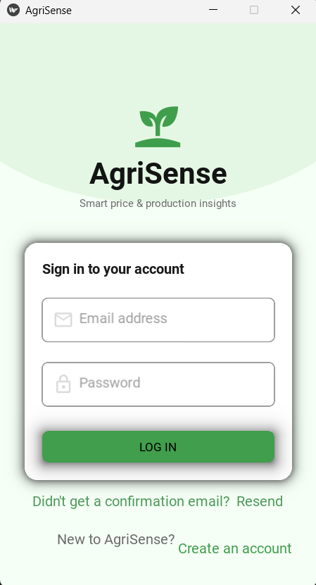 | 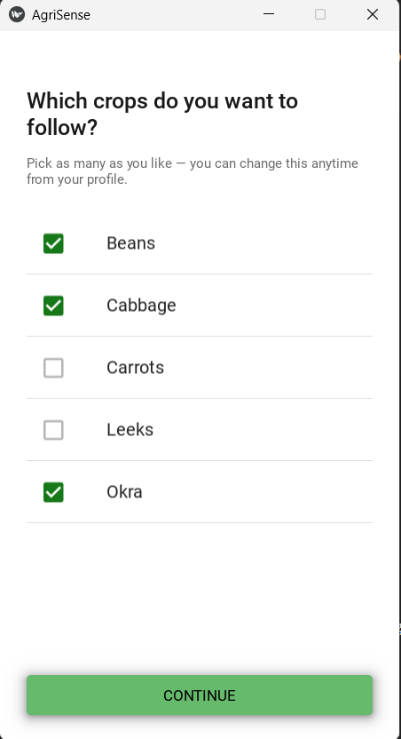 |

### 📊 Role-Based Dashboards

| Admin Dashboard | Farmer Dashboard |
|:---:|:---:|
| 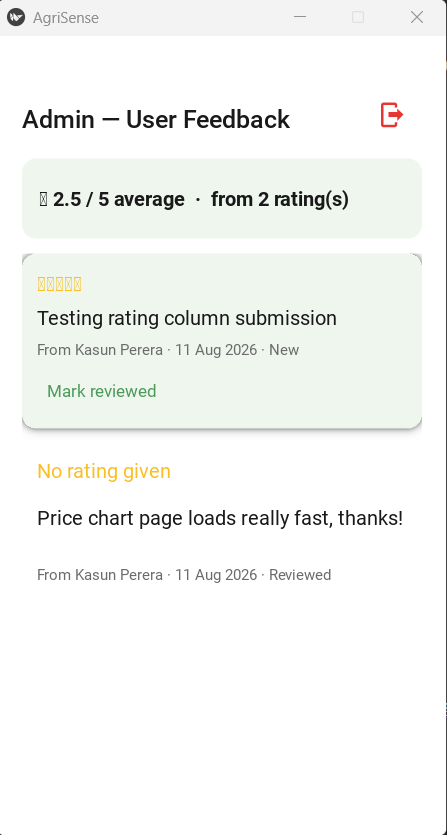 | 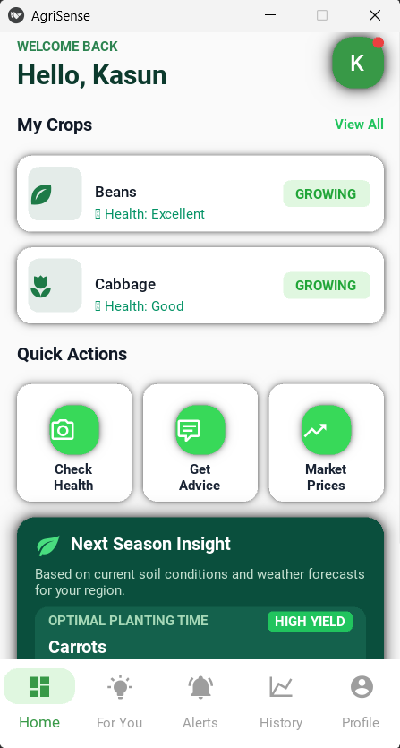 |

| Policymaker Dashboard | Trader Dashboard |
|:---:|:---:|
| 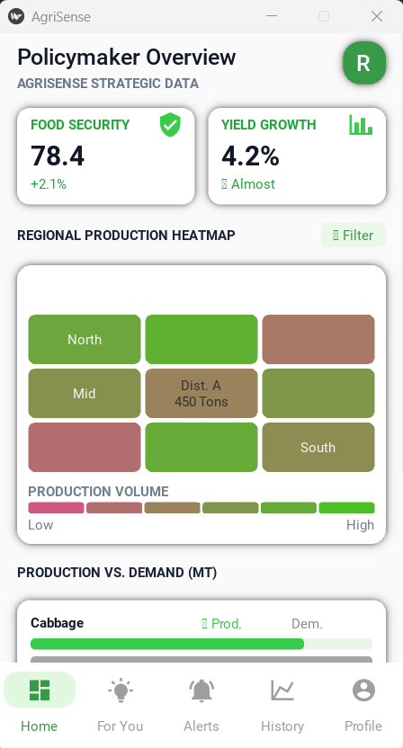 | 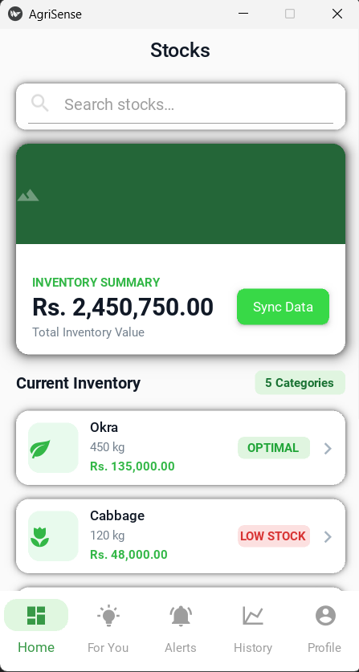 |

### 🔔 Insights & Alerts

| For You — Recommendations | Alerts |
|:---:|:---:|
| 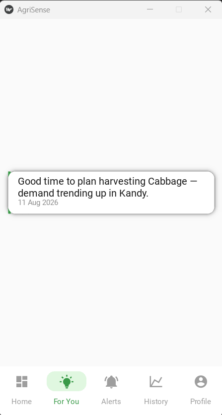 | 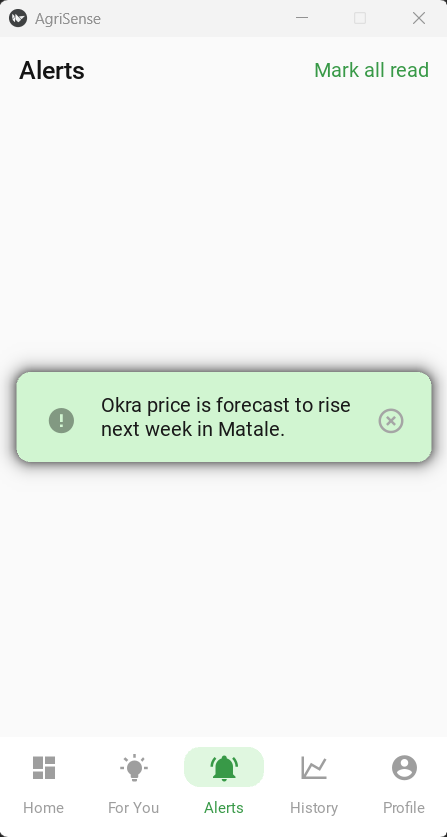 |

### 📈 History & Analytics

| Beans — Price Trend (16 Weeks) | Beans — Production Volume (16 Weeks) |
|:---:|:---:|
| 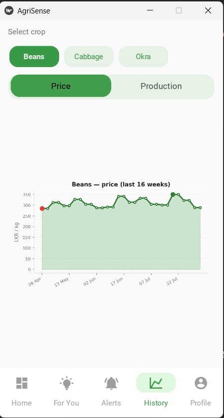 | 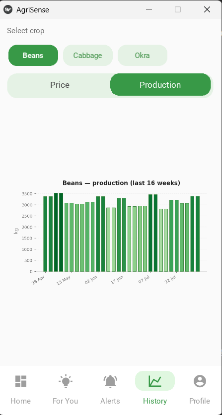 |

### 👤 Profile & Settings

| Profile | Edit Profile | Feedback |
|:---:|:---:|:---:|
| 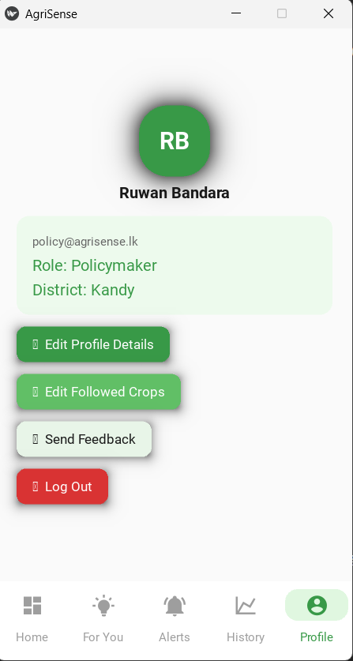 | 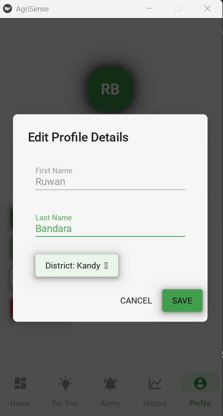 | 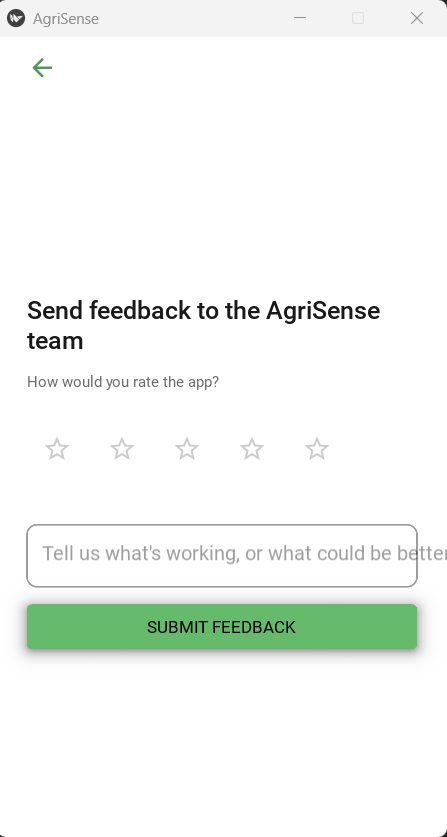 |

---

## ✨ Overview & Key Features

AgriSense addresses agricultural market volatility and crop overproduction/shortage issues through data intelligence.

### 🌟 Key Highlights

- **Role-Based Dashboards**: Customized interface tailored to user persona:
  - **Farmer**: Harvest planning, yield forecasts, market price trends, crop recommendations, and alert notifications.
  - **Trader**: Wholesale price projections, regional crop availability, price spike alerts, and market supply analytics.
  - **Policymaker**: National production trends, regional supply balance, climate impact monitoring, and policy recommendations.
  - **Admin**: User management, database seeding overview, system analytics, and user feedback monitoring with average rating metrics.
- **AI/ML Forecasting Engine**: Integration ready for **LSTM** time-series price predictions and **Random Forest** seasonal crop production yield models.
- **Interactive Visualizations**: Dynamic Matplotlib charts rendered seamlessly within KivyMD views for intuitive data analysis.
- **Smart Notification System**: Automated alert generation for price spikes, sharp market drops, regional oversupply, and crop shortages.
- **Email Verification Flow**: Secure user registration with bcrypt password hashing and tokenized email confirmation (via SMTP and Flask).
- **Password Strength & Crop Selection**: Built-in real-time password strength validation and seamless favourite crop onboarding.
- **5-Star Rating & Feedback Hub**: Direct feedback pipeline connecting users with platform administrators featuring star rating summaries.
- **Enhanced Visual UX**: Animated splash screen with growing sprout logo, smooth slide transitions, and staggered card animations.

---

## 🏗 System Architecture

```
                                +---------------------------+
                                |      AgriSense App        |
                                |  (KivyMD Mobile / Desktop)|
                                +-------------+-------------+
                                              |
                   +--------------------------+--------------------------+
                   |                                                     |
        +----------v----------+                               +----------v----------+
        |   Auth & Security   |                               |  Data Visualization |
        | (bcrypt, SMTP, Auth)|                               |  (Matplotlib Charts)|
        +----------+----------+                               +----------+----------+
                   |                                                     |
                   +--------------------------+--------------------------+
                                              |
                                +-------------v-------------+
                                |    SQLAlchemy ORM Layer   |
                                +-------------+-------------+
                                              |
                                +-------------v-------------+
                                |     MySQL Database        |
                                |      (vectamind_db)       |
                                +-------------+-------------+
                                              ^
                                              |
                   +--------------------------+--------------------------+
                   |                                                     |
        +----------+----------+                               +----------+----------+
        |  ML Model Pipelines |                               | Flask Confirm Server|
        | (LSTM / RF Outputs) |                               | (Email Token Auth)  |
        +---------------------+                               +---------------------+
```

---

## 🛠 Technology Stack

- **User Interface**: [Kivy 2.3.0](https://kivy.org/), [KivyMD 1.2.0](https://kivymd.readthedocs.io/)
- **Backend Architecture**: Python 3.10+, SQLAlchemy ORM, PyMySQL
- **Database**: MySQL Server 8.0+
- **Machine Learning & Analytics**: TensorFlow 2.16, Scikit-Learn 1.5, Pandas, NumPy
- **Data Visualization**: Matplotlib, `kivy-garden.matplotlib`
- **Security & Authentication**: `bcrypt`, `python-dotenv`, SMTP protocol
- **Microservice / Utility**: Flask (Account verification server)
- **Mobile Packaging**: Buildozer, Cython (Android APK target)

---

## 📁 Project Directory Structure

```
AgriSense/
│
├── main.py                     # Main application entry point & screen manager
├── requirements.txt            # Python dependencies specification
├── buildozer.spec              # Android APK build configuration
├── .env.example                # Template for environment variables
├── .gitignore                  # Git exclusion rules
├── README.md                   # Comprehensive English project documentation
│
├── database/                   # Database & ORM module
│   ├── schema.sql              # Complete MySQL database schema
│   ├── migration_add_rating.sql# Database migration script for feedback ratings
│   ├── db_connection.py        # SQLAlchemy engine & session factory
│   ├── models.py               # ORM data models (User, Crop, Price, Alert, etc.)
│   ├── data_service.py         # Data access queries & UI data formatting
│   ├── auth_service.py         # Registration, authentication & token verification
│   ├── seed_demo_data.py       # Data generator (2 years weekly demo dataset)
│   └── confirm_server.py       # Flask server handling email link verification
│
├── screens/                    # KivyMD UI Screen Components
│   ├── loading_screen.py       # Animated splash / launch screen
│   ├── login_screen.py         # User login screen with validation
│   ├── register_screen.py      # Registration with email check & password strength meter
│   ├── crop_selection_screen.py# Onboarding crop selection UI
│   ├── dashboard_screen.py     # Role-based dashboard (Farmer, Trader, Policymaker)
│   ├── admin_dashboard_screen.py# Administrator management dashboard
│   └── feedback_screen.py      # User feedback screen with 5-star rating system
│
└── utils/                      # Helper & Utility Modules
    ├── theme.py                # Color palette & visual styling tokens
    ├── auth_utils.py            # Bcrypt hashing & SMTP email delivery logic
    ├── chart_utils.py           # Matplotlib chart generator functions
    ├── validators.py           # Email & password validation utilities
    ├── animations.py           # KivyMD UI animation helpers
    └── layout_helpers.py       # Visual layout & screen transition utilities
```

---

## ⚙️ Prerequisites

Before installing and running AgriSense, ensure you have the following installed:

- **Python**: Version 3.10 or higher
- **MySQL Server**: Version 8.0 or higher (or MariaDB equivalent)
- **Git**: Latest version
- **Virtual Environment**: `venv` (recommended)

---

## 🚀 Installation & Setup

### 1. Clone the Repository

```bash
git clone https://github.com/KushanLaksitha/AgriSense2.1.git
cd AgriSense2.1
```

### 2. Create and Activate a Virtual Environment

- **On Windows (PowerShell / Command Prompt)**:
  ```cmd
  python -m venv venv
  venv\Scripts\activate
  ```

- **On Linux / macOS**:
  ```bash
  python3 -m venv venv
  source venv/bin/activate
  ```

### 3. Install Dependencies

```bash
pip install -r requirements.txt
```

> **Note for Windows Users**: If you encounter installation issues with Kivy/KivyMD, install base packages first before running requirements:
> ```cmd
> pip install kivy[base] kivy_examples --pre
> pip install -r requirements.txt
> ```

---

## 🗄 Database Setup & Seeding

### 1. Create the Database Schema

Import `database/schema.sql` into your MySQL server via MySQL Workbench, DBeaver, or command line:

```bash
mysql -u root -p < database/schema.sql
```

*(Optional)* If upgrading an existing installation that predates the feedback rating feature, run the migration script:
```bash
mysql -u root -p vectamind_db < database/migration_add_rating.sql
```

### 2. Configure Environment Variables (`.env`)

Copy `.env.example` to create your local `.env` configuration file:

- **Windows (PowerShell)**:
  ```powershell
  Copy-Item .env.example .env
  ```
- **Linux / macOS**:
  ```bash
  cp .env.example .env
  ```

Open `.env` and set your MySQL credentials and SMTP email configuration:

```env
# ---- MySQL Database Configuration ----
DB_HOST=localhost
DB_PORT=3306
DB_USER=root
DB_PASSWORD=your_actual_mysql_password
DB_NAME=vectamind_db

# ---- Email / SMTP Configuration ----
SMTP_HOST=smtp.gmail.com
SMTP_PORT=587
SMTP_USER=your_email@gmail.com
SMTP_PASSWORD=your_google_app_password
SMTP_SENDER_NAME=AgriSense

# ---- Account Confirmation URL ----
CONFIRM_BASE_URL=http://127.0.0.1:5000/confirm
```

### 3. Seed Demo Data

Populate the database with 2 years of weekly price, production, and climate records, along with default test accounts, alerts, and recommendations:

```bash
python database/seed_demo_data.py
```

---

## ✉️ Email Confirmation Endpoint

AgriSense includes an automated email confirmation workflow upon registration.

To run the confirmation server locally:

```bash
python database/confirm_server.py
```

- When running locally, links sent to emails will point to `http://127.0.0.1:5000/confirm`.
- When testing on a physical mobile device, replace `127.0.0.1` in `.env` under `CONFIRM_BASE_URL` with your development computer's Local Area Network (LAN) IP address (e.g., `http://192.168.1.100:5000/confirm`).
- **Development Mode**: If SMTP parameters are omitted, registration links are printed to the console for testing.

---

## 🖥 Running the Application

Launch the main application on desktop (runs with a simulated 400x820 mobile aspect ratio for optimal layout testing):

```bash
python main.py
```

---

## 🔑 Demo User Credentials

Once `seed_demo_data.py` has executed, you can log in using any of the pre-configured accounts:

| User Persona | Email Address | Password | Features Accessible |
| :--- | :--- | :--- | :--- |
| **Farmer** | `farmer@agrisense.lk` | `Demo@1234` | Harvest advice, crop price charts, yield recommendations |
| **Trader** | `trader@agrisense.lk` | `Demo@1234` | Price trend predictions, regional crop availability alerts |
| **Policymaker** | `policy@agrisense.lk` | `Demo@1234` | National market analytics, climate impact reports |
| **Admin** | `admin@agrisense.lk` | `Demo@1234` | User management, rating metrics, feedback review board |

---

## 📱 Android APK Build Guide (Buildozer)

AgriSense is fully configured for compilation to Android target APKs using **Buildozer**.

### Building on Linux / WSL2:

1. Install system prerequisites & Buildozer:
   ```bash
   sudo apt update && sudo apt install -y git zip unzip openjdk-17-jdk python3-pip autoconf libtool pkg-config zlib1g-dev libncurses5-dev libncursesw5-dev libffi-dev libssl-dev
   pip install buildozer cython
   ```

2. Compile the Android Debug APK:
   ```bash
   buildozer -v android debug
   ```

3. The generated `.apk` file will be saved in the `bin/` directory.

> ⚠️ **Important Device Networking Note**: When deploying the APK to a physical Android phone, `DB_HOST` inside `.env` cannot be `localhost`. Point `DB_HOST` to a publicly accessible IP address or your local host machine's network IP.

---

## 🤖 Machine Learning Integration

AgriSense features ORM models engineered to store outputs from machine learning models:

- **Price Predictions (LSTM Time-Series Model)**: Outputs estimated market prices for key Sri Lankan vegetables (*Okra, Cabbage, Beans, Carrots, Leeks*).
- **Yield Predictions (Random Forest Regressor)**: Outputs estimated production volumes based on climate variables (*Rainfall, Temperature, Humidity*) and historical seasonal data (*Maha/Yala*).

To populate live predictions programmatically, insert records into the `prediction` table using `database/models.py`:

```python
from database.db_connection import get_session
from database.models import Prediction
from datetime import date

db = get_session()
new_pred = Prediction(
    prediction_type="price",
    prediction_value=245.50,
    prediction_date=date(2026, 9, 1),
    crop_id=1,
    region_id=1
)
db.add(new_pred)
db.commit()
db.close()
```

The UI dashboard charts and recommendation tabs update dynamically without requiring code modifications.

---

## 📊 Database Schema & Migrations

The database structure consists of key normalized tables:

- **`user`**: Accounts, roles (`farmer`, `trader`, `policymaker`, `admin`), password hashes, activation state.
- **`crop`**: Core crops tracked (*Okra, Cabbage, Beans, Carrots, Leeks*).
- **`region`**: Regional districts (*Matale Region, Kandy Region*).
- **`production`**: Historical and seasonal yield records.
- **`price`**: Historical wholesale/retail vegetable prices (LKR/kg).
- **`climate`**: Rainfall (mm), temperature (°C), and humidity (%).
- **`prediction`**: Machine learning forecast outputs for price & production.
- **`alert`**: Generated automated user alerts.
- **`recommendation`**: Actionable insights per crop and region.
- **`feedback`**: User feedback records with 1–5 star ratings.

---

## 👤 Author & License

- **Developer / Maintainer**: [Kushan Laksitha](https://github.com/KushanLaksitha)
- **Repository**: [AgriSense2.1](https://github.com/KushanLaksitha/AgriSense2.1)
- **License**: Distributed under the MIT License. See `LICENSE` for details.

---

*Made with ❤️ for Sri Lankan Agriculture.*